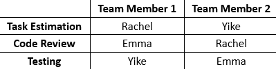
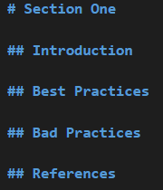

# Project Plan

## Topics & Assigned Team Members

## Project Plan
1. Get in contact with other members of the group 
	- Organise first meeting (Planning meeting)
2. Have planning meeting 
    - Discuss and put together a list of the different tasks that need to be completed 
3. Create GitHub Repo 
	- Create develop branch 
4. Make sure everyone has access to the repo 
5. Add "planning" file to the repo 
6. Decide as a group, what the third topic will be 
7. Assign team members to each topic (2 per topic) 
8. Create feature branch and start research into the first topics 
	- Brief Overview 
	- Good Practices 
	- Bad Practices 
9. Merge section into the develop branch 
10. Organise a second meeting for the week of the 20th of March - 1st Checkpoint 
11. Have 1st checkpoint meeting 
12. Start research into the second topics - add to existing files 
	- Brief Overview 
	- Good Practices 
	- Bad Practices 
13. Merge section into the develop branch 
14. Organise a third meeting for the week of the 27th of March - 2nd Checkpoint 
15. Have 2nd checkpoint meeting 
16. Put together the main README/Introduction file with links to the different sections 
17. Put together a list of things we would have done differently and add to repo 
18. Merge the develop branch into the main branch 
19. Send link to GitHub Repo on Brightspace 

## Structure of Sections

## Branching
<b>Naming Convention</b>
- [author name]-[feature name] 
- Example: 
	- rachel-task-estimation 
	- emma-code-review 
	- yike-testing 
- [Reference](https://www.scaler.com/topics/git/git-branch-naming-conventions/)

## What We Would Do Differently

-	Stick to the plan 
-	Walk through doing our first pull request together to ensure we were all doing the same thing

-	Schedule more regular meetings rather than just texting to ensure that we were all on the same page

- 	Set realistic deadlines to follow 

