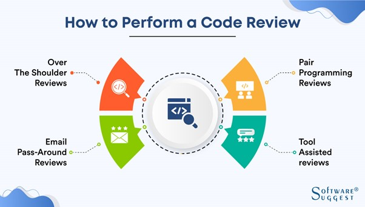
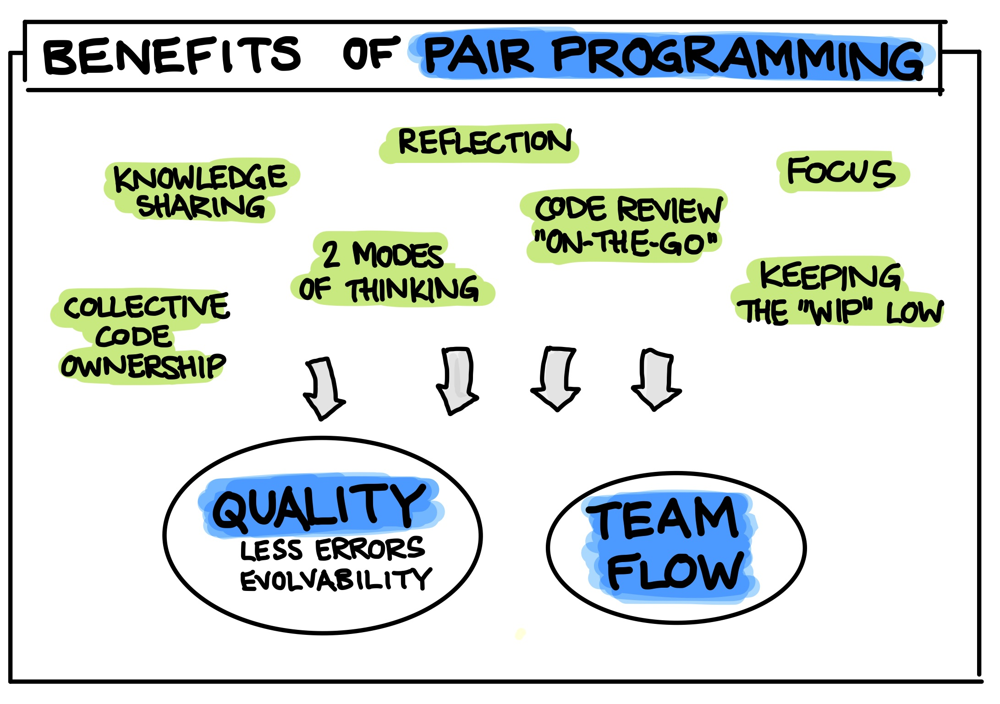
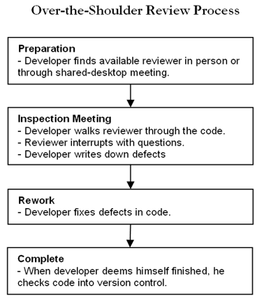

# Code Reviews
## Introduction
Code Review (or peer code review) is an important step in the software development process. It is the act of getting a  fellow programmers to check each other's code for mistakes before it is merged into a branch. 
The main goal of a code review is to make the code better. Reviewing another person's code, however, is much easier said than done. Code review entails one or more team members reviewing the work of another team member. This entails reviewing source code modifications prior to their incorporation into the codebase. Code reviews have repeatedly shown to accelerate and streamline the process of software development.

## Methods for Code Reviews

Code reviews can be divided into 4 sub categories:

**1. Instant code review – Pair programming**

Pair programming is when one developer is producing code and the other developer is reviewing the code right on the spot, paying attention to potential issues and giving ideas for code improvement on the go. 

According to (Herbi, 2018), they used pair programming when working on a task which requires a lot of complex business logic. Pair programming works well when two developers with a similar level of experience work together on solving a complex business problem.

**Benefits and Drawbacks of Pair Programming**

|     | Benefits                | Drawbacks                |     |
| :-- | ----------------------- | ------------------------ | --- |
|     | Transfers knowledge     | Time-consuming           |     |
|     | Improved code quality   | Higher development costs |     |
|     | Solves complex problems | Can be overused          |     |
|     | Greater resilience      | Sustainability           |     |
|     | Fewer bugs and mistakes |                          |     |
|     | Better team Morale      |                          |     |

**2. Synchronous code review – Over-the-shoulder code review**

Here the coder produces the code themself and asks the reviewer for a review immediately when they are done with coding. The reviewer joins the coder at their desk, and they look at the same screen while reviewing, discussing, and improving the code together.

**Benefits and Drawbacks of Over-the-shoulder Reviews**
|     | Benefits                           | Drawbacks                              |     |
| :-- | ---------------------------------- | -------------------------------------- | --- |
|     | Easy implementation and completion | Reviewer is detached from code         |     |
|     | Collaboration                      | Lack of Traceability                   |     |
|     | Can be conducted remotely          | Location                               |     |
|     | No training needed                 | Not an enforceable process             |     |
|     | In-person learning                 | No verification that changes were made |     |
|     | Faster than pair programming       | Difficult to measure                   |     |

## Best Practices
1. **Don't review more than 200-400 lines of code at a time**
2. **Don't rush your review** 
3. **Use a code review checklist** -  A code review checklist is a predetermined set of questions and rules your team will follow during the code review process and it will provide team members with clear expectations for each type of review
4. **Provide constructive feedback**
5. **Set Goals and Capture metrics** - Before implementing a process, your team should decide how you will measure the effectiveness of peer review and name a few tangible goals. 

## Common Pitfalls of Code Reviews 

1. **Time and resource constraints** - Code reviews can take a lot of time because they call for developers to review and comment on each other's work. Organizations that are working under a strict deadline or with limited resources may find this particularly difficult.
2. **Personal Preferences** - When it comes to coding style and methods, individual developers may have different tastes, which might cause disagreement or conflict during code reviews.
3. **Miscommunication** - As the review process is frequently conducted remotely and may involve numerous reviewers providing feedback on the same code, code reviews are susceptible to misunderstandings. 
4. **Decreased Morale** - Code reviews can lower developer morale if they are not handled in a helpful and productive way.
5. **Limited focus** - A code review might not be able to find every bug in the code and might miss certain important details. As a result, some problems might not be discovered until much later in the development process, requiring more time and money to address.
6. **The only purpose is to find defects** 
7. **Only Senior developers review code** - Have everyone who writes code work on code reviews, as different developers will find different problems and solutions.
8. **Indicate issues without suggesting an alternative or solution** 

## References
- [Code reviews: pros and cons, approaches, tools and tips](https://swimm.io/learn/code-reviews/code-reviews-pros-and-cons-approaches-tools-and-tips/) by Swimm Team
- [4 Types Of Code Reviews Any Developer Should Know](https://www.scrum-tips.com/agile/types-of-code-reviews/#:~:text=Instant%20code%20review%E2%80%94also%20known,as%20meeting%2Dbased%20code%20review) by Herbi
- [Code Review Best Practices](https://www.perforce.com/blog/qac/9-best-practices-for-code-review) by Richard Bellairs
- [Code Review](https://developerexperience.io/articles/code-review) by DXKB
- [Best Practices for Code Review](https://smartbear.com/learn/code-review/best-practices-for-peer-code-review/) by Smartbear
- [5 code review best practices](https://www.atlassian.com/blog/add-ons/code-review-best-practices) by Usman Ghani
- [6 code review best practices for a happier codebase and team](https://www.educative.io/blog/code-review-best-practices) by Erica Vartanian
- [For better code and happier devs - six code review pitfalls to avoid](https://polarsquad.com/blog/make-code-reviews-work) by Risto Laurikainen
- [Best code review practices: 5 errors to avoid](https://www.promyze.com/code-review-best-practices/) by Promyze
- [Good and bad Code Review examples](https://medium.com/transparent-data-eng/good-and-bad-code-review-examples-219c0024e6b0) by Mateusz Antkowiak
- [What is a code review](https://about.gitlab.com/topics/version-control/what-is-code-review/) by GitLab
- [What is Code Review?](https://smartbear.com/learn/code-review/what-is-code-review/) by Smartbear