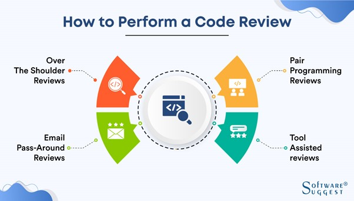
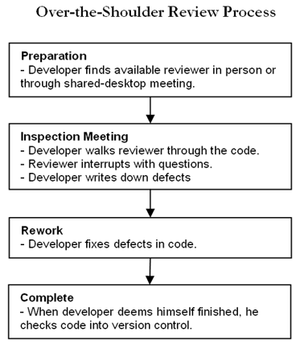

# Code Reviews
## Introduction
Making code better is the main goal of code reviews. Reviewing another person's code, however, is much easier said than done. Code review, also referred to as a peer code review, entails one or more team members reviewing the work of another team member. This entails reviewing source code modifications prior to their incorporation into the codebase.

## Methods for Code Reviews

Code reviews can be divided into 4 sub categories:

**1.Instant code review – Pair programming**
Pair programming is when one developer is producing code and the other developer is reviewing the code right on the spot, paying attention to potential issues and giving ideas for code improvement on the go. 
According to (Herbi, 2018), they used pair programming when working on a task which requires a lot of complex business logic. Pair programming works well when two developers with a similar level of experience work together on solving a complex business problem.

**Benefits of Pair Programming**
-	Transfers knowledge
-	Improved code quality
-	Solves complex problems 
-	Greater resilience
-	Fewer bugs and mistakes
-	Better team Morale

**Drawbacks of Pair Programming**
-	Time-consuming 
-	Higher development costs
-	Can be overused 
-	Sustainability

**2.Synchronous code review – Over-the-shoulder code review**
Here the coder produces the code themself and asks the reviewer for a review immediately when they are done with coding. The reviewer joins the coder at their desk, and they look at the same screen while reviewing, discussing, and improving the code together.

**Benefits of Over-the-shoulder Reviews**
-	Easy implementation and completion 
-	Collaboration
-	Can be conducted remotely 
-	No training needed
-	In-person learning
-	Faster than pair programming 

**Drawbacks of Over-the-shoulder Reviews**
-	Reviewer is detached from code
-	Lack of Traceability 
-	Location
-	Not an enforceable process
-	No verification that changes were made 
-	Difficult to measure

## Common Pitfalls of Code Reviews 
-	Time and resource constraints: Code reviews can take a lot of time because they call for developers to review and comment on each other's work. Organizations that are working under a strict deadline or with limited resources may find this particularly difficult.
-	Personal Preferences: When it comes to coding style and methods, individual developers may have different tastes, which might cause disagreement or conflict during code reviews.
-	Miscommunication: As the review process is frequently conducted remotely and may involve numerous reviewers providing feedback on the same code, code reviews are susceptible to misunderstandings.
-	Decreased Morale: Code reviews can lower developer morale if they are not handled in a helpful and productive way.
-	Limited focus: A code review might not be able to find every bug in the code and might miss certain important details. As a result, some problems might not be discovered until much later in the development process, requiring more time and money to address.

## References
- [Code reviews: pros and cons, approaches, tools and tips](https://swimm.io/learn/code-reviews/code-reviews-pros-and-cons-approaches-tools-and-tips/)
- [4 Types Of Code Reviews Any Developer Should Know](https://www.scrum-tips.com/agile/types-of-code-reviews/#:~:text=Instant%20code%20review%E2%80%94also%20known,as%20meeting%2Dbased%20code%20review)

- [9 Best Practices for Code Review](https://www.perforce.com/blog/qac/9-best-practices-for-code-review)

- [Code Review](https://developerexperience.io/articles/code-review)