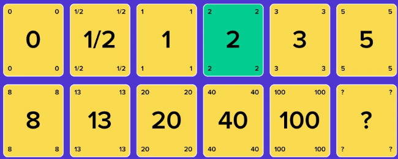
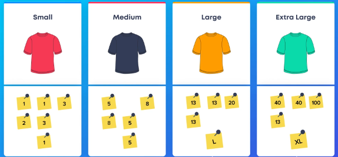
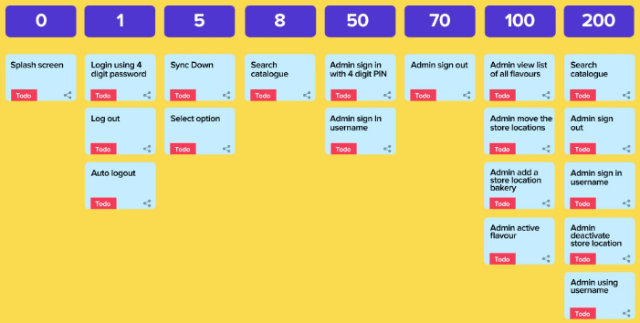

# Task Estimation
Task Estimation is an essential part of the agile process, it allows developers to estimate the effort needed to complete tasks from the product backlog. It allows developers to measure how much time a task will take and plan sprints more accurately. Task Estimation occurs during a Sprint Planning meeting, which is a time-boxed event where the team will discuss and determine the work that will be done in the upcoming sprint. Task Estimation is crucial in helping the team to understand the capacity they have for the upcoming sprint and to prioritize the work that needs to be done.

## Methods for Task Estimation
There are many different methods used when estimating tasks, including Planning Poker, T-Shirt Size Estimation and The Bucket System Estimation, to name a few. 

1. <b>Planning Poker</b> 
    
    Planning Poker is one of the most common estimation techniques. The SCRUM master will describe the user story to the team and each member will select a number for an estimation. The card with the most votes is the finalized estimation. 

    

2. <b>T-Shirt Size Estimation</b>

    T-Shirt Size Estimation is largely used for grouping together tasks of a similar size. The tasks are estimated in standard t-shirt sizes (i.e., XS, S, M, L, and XL). This method is more of an informal but creative technique.

    

3. <b>The Bucket System Estimation</b>

    This Bucket System is when different buckets are created with values ranging from 0 to 200 and the developers place each task into the most suitable bucket. 

    

## Best Practices
Here are some the most important practices to follow in task estimation in Scrum:

1. <b>Break down tasks into smaller pieces</b>
2. <b>Work as team</b> - Task Estimation requires active communication and collaboration.
3. <b>Gather Information</b> - Make sure you have a thorough understanding of the task

## Bad Practices
Here are some of the most common bad practices to avoid in task estimation in Scrum:

1. <b>Lack of understanding of a task</b>
2. <b>Over-smart Estimation</b> - When one team member tries to show his/her capability by giving fewer points to a story 
3. <b>One Sit All Estimation</b> - Avoid estimating all tasks in one sitting, as not all team members are capable of quickly understanding the story and providing estimates. They need time to understand the task. 

## References
For further reading on task estimation in Scrum, we recommend the following resources:
- [Top 8 Agile Estimation Techniques(Explained with Examples)](https://www.netsolutions.com/insights/how-to-estimate-projects-in-agile/#what-is-estimation-in-agile) by Satinder Singh  
- [Tips for Effective Tasks Estimation in Scrum Planning Meetings](https://liuhongbo.medium.com/tips-for-effective-task-estimation-in-scrum-planning-meetings-c7a6af2c4966) by Hongbo Liu
- [Top 5 Scrum Estimation Techniques - Find Your Best Fit]( https://www.knowledgehut.com/blog/agile/top-5-scrum-estimation-techniques-find-your-best-fit) by Deepti Sinha
- [8 Agile Estimation Mistakes that Every Team Should Avoid](https://doasync.com/blog/8-agile-estimation-mistakes-to-avoid/) by Async Poker