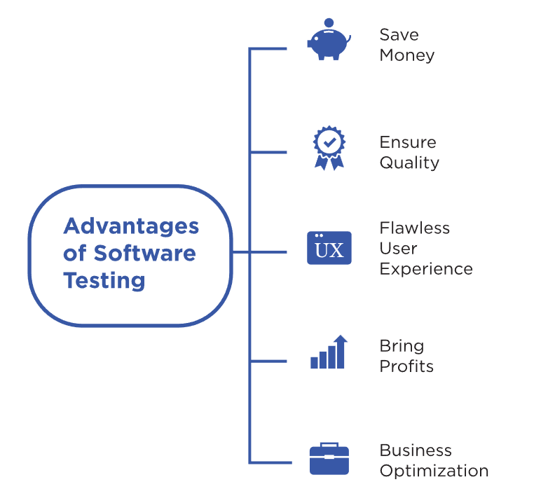

# Testing
## Introduce
Testing is a crucial part of the software development process that helps ensure that the final product meets the requirements and is free of defects. In this guide, we'll walk you through the software testing process, including the different types of testing, tools used in testing, and best practices to follow.
## Why
Software testing is the process of verifying and validating a software system to ensure that it functions as intended and meets the needs of the end-users. It involves executing the software with the intention of finding defects or errors and ensuring that the system meets the specified requirements. Software testing is like trying on a pair of shoes before buying them - you want to make sure they fit and feel comfortable. Testing helps you identify any defects or bugs in the software before it's released to your users.

## Advantages  
1. Saves Money
   * Finding and fixing bugs early in the development cycle is much cheaper than discovering and fixing them later on. This can save a lot of money in the long run.
2. High Quality
   * Testing ensures that the software meets the expected quality standards. This helps build a good reputation and trust with your users.
3. User Experience
   * Testing helps ensure that the software is easy to use, bug-free, and meets the needs of your users. A positive user experience can lead to increased user engagement and loyalty.    
4. Brings Profits
   * High-quality software that meets user needs can lead to increased sales, customer satisfaction, and brand loyalty. This can ultimately bring in more profits for your business.
5. Business Optimization
   * Testing can help identify areas of the software that can be optimized, such as performance or security. This can lead to a more efficient and effective business operation.

## What are the Types of Software Testing?
Software testing can be broadly classified into two types: manual testing and automation testing.
### Manual Testing
Manual Testing involves the process of manually executing test cases and generating the test results. This type of testing requires a skilled tester to run the test cases and analyze the test results. Manual testing is suitable for test cases that require a human touch, such as testing the user interface and usability.
### Automation Testing
Automation Testing involves the process of using automated tools to run the test cases and generate the test results. This type of testing requires a skilled automation engineer to design, develop, and maintain the test scripts. Automation testing is suitable for test cases that can be repeated multiple times and require a high level of accuracy and speed, such as testing the performance and scalability of the software.

Both manual testing and automation testing have their own advantages and disadvantages. It is important to choose the right type of testing based on the project requirements, budget, and timeline. A combination of both manual and automation testing can provide the best results.

## Good Practices:
Here are some the most important practices to follow in task estimation in Scrum:
1. Plan your testing efforts and establish clear objectives and goals.
2. Use a combination of automated and manual testing methods to cover a wide range of scenarios and edge cases.
3. Test early and often throughout the development cycle to catch bugs and issues early.
4. Create a testing environment that closely mirrors the production environment.
5. Document test results and keep track of bugs and defects to help improve the quality of the software.
6. Involve the entire team in the testing process to get a more comprehensive understanding of the software and its capabilities.
7. Prioritize testing based on risk and criticality of the features being developed.
8. Use a variety of testing techniques, such as unit testing, integration testing, and user acceptance testing, to ensure comprehensive coverage.
9. Ensure that testing is part of the continuous integration and deployment process.
10. Continuously monitor and review the testing process to identify areas for improvement.
## Bad Practices:
Here are some the most important practices to follow in task estimation in Scrum:
1. Relying solely on manual testing, which can be time-consuming and error-prone.
2. Ignoring testing in the early stages of development, which can lead to more bugs and issues later on.
3. Not properly documenting test results and not tracking bugs and defects, which can make it difficult to improve the software.
4. Testing in a different environment than the production environment, which can lead to unexpected issues when the software is deployed.
5. Not involving the entire team in testing, which can result in a narrow focus on certain aspects of the software.
6. Testing only the happy path and ignoring edge cases, which can lead to unexpected issues when the software is used in the real world.
7. Not prioritizing testing based on risk and criticality, which can lead to important issues being missed.
8. Failing to use a variety of testing techniques, which can result in gaps in coverage.
9. Not integrating testing into the continuous integration and deployment process, which can slow down the development cycle and lead to delays.
10. Not continuously monitoring and reviewing the testing process, which can lead to missed opportunities for improvement.

## References
[A COMPLETE GUIDE ON SOFTWARE TESTING](https://www.leewayhertz.com/software-testing-process/) by LeewayHertaz

[Ammann, P., & Offutt, J. (2016). Introduction to software testing. Cambridge University Press.](https://books.google.ie/books?hl=zh-CN&lr=&id=58LeDQAAQBAJ&oi=fnd&pg=PR10&dq=software+testing&ots=VAkXKNVO-Y&sig=_S6-G8AA-7L56TlZe_RhyyowGW0&redir_esc=y#v=onepage&q=software%20testing&f=false)

[Everett, G. D., & McLeod Jr, R. (2007). Software testing. Testing Across the Entire.](http://worldcolleges.info/sites/default/files/software-testing-testing-across-the-entire-software-development-life-cycle.9780471793717.28214.pdf)